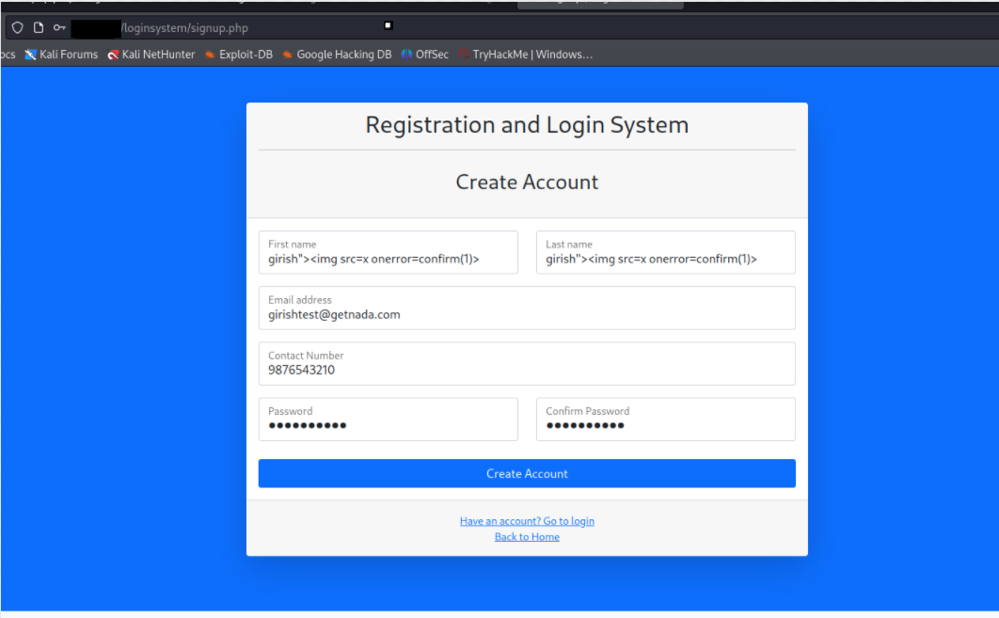
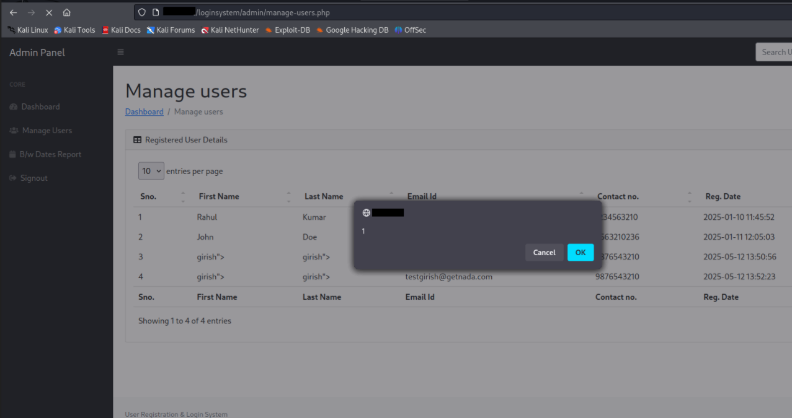

# [Stored Cross-Site Scripting (XSS)] in [User Registration & Login and User Management System with Admin Panel] <= v1.0  
**BUG Author:** Girish

---

## Product Information
- **Vendor:** PHPGurukul  
- **Project Page:** [https://phpgurukul.com/user-registration-login-and-user-management-system-with-admin-panel/](https://phpgurukul.com/user-registration-login-and-user-management-system-with-admin-panel/)  
- **Affected Version:** ≤ v1.0  
- **Tested On:** Localhost (`http://localhost/loginsystem/`)

---

## Vulnerability Details
- **Type:** Stored Cross-Site Scripting (XSS)  
- **CWE ID:** [CWE-79](https://cwe.mitre.org/data/definitions/79.html)  
- **Severity:** HIGH (CVSS 3.1 Score: 8.0)  
- **Attack Vector:** Remote, Persistent  

---

## Affected Components
- `signup.php` (user input)  
- `admin/dashboard.php` (admin output)

---

## Root Cause
User-controlled input (`First Name`, `Last Name`) is not sanitized or encoded before being displayed in the **Total Registered Users** section of the Admin Dashboard. This allows stored XSS payloads to execute when viewed by an admin.

---

## Proof of Concept (PoC)

1. Navigate to: http://localhost/loginsystem/signup.php
2. Input the following payload in the **First Name** or **Last Name** field:  
  "girish">"

4. Complete the registration.  
5. Log in as Admin and go to:
http://localhost/loginsystem/admin/dashboard.php

6.A JavaScript alert(1) will be triggered — confirming the stored XSS.

**Attack Scenario**
An attacker signs up with an XSS payload in their name field. When the admin visits the dashboard to manage users, the injected script executes in the context of the admin’s browser session. This can lead to:

Session hijacking
Admin panel manipulation
Theft or alteration of data

**Recommendations**
Sanitize user inputs using htmlspecialchars() or equivalent.
Encode all dynamic HTML content before rendering in the frontend.
Implement input validation on both the client and server sides.
Apply a Content Security Policy (CSP) to reduce script injection risks.

